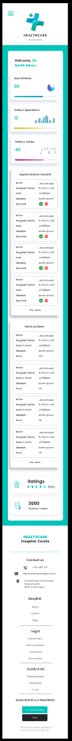

# HOSPITAL DASHBOARD UI DESIGN AND BASIC IMPLEMENTATION

## PART 1: UX/UI DESIGN

- prototype of a web application for managing patient appointments has been developed.
- mobile and desktop versions
- includes a welcome page, a login page, a dashboard page presenting general hospital information and an appointment management page.
- [PrototypeMobil](https://www.figma.com/proto/3su5cyuSUrOBThl4z7sU4p/Untitled?page-id=0%3A1&type=design&node-id=2-3&viewport=939%2C283%2C0.25&t=8bwrZSXBniVy9nhF-1&scaling=min-zoom&starting-point-node-id=2%3A3&show-proto-sidebar=1)
- [PrototypeDesktop](https://www.figma.com/proto/3su5cyuSUrOBThl4z7sU4p/Untitled?page-id=0%3A1&type=design&node-id=34-1276&viewport=939%2C283%2C0.25&t=8bwrZSXBniVy9nhF-1&scaling=min-zoom&starting-point-node-id=34%3A1269&show-proto-sidebar=1)
- [UserFlowDiagram]()
  
### OVERVIEW MOBIL FIGMA

### OVERVIEM DESKTOP FIGMA

## PART 2/3 HTML/CSS/JS IMPLEMENTATION

- the prototype has been designed in html css and js
- javascript has been used to implement the login and navigation menu functionalities.
- user mail: `useremail`
- password: `password`
- the design has been realized using the mobil first technique.
- each html has its own css style sheet to make each style more accessible
- the stylesheet `styles.css` contains generic styles, reset css, and styles for the menu and footer.
- files:
  - `appointment.html` and his `appointment.css` represents the patient appointment management feature.
  - `construction.html` and his `construction.css` represents the pages that are not done, and therefore looks like a page under construction.
  - `index.html` and his `index.hmtl` is the welcome page that allows access to the login page.
  - `login.html` and his `login.css` is the login page that allows access to the others pages of the project.
  - `script.js` includes functions related to the navigation and login menu. 
- [GitHubLink]()

### OVERVIEM DESKTOP HTML

1

